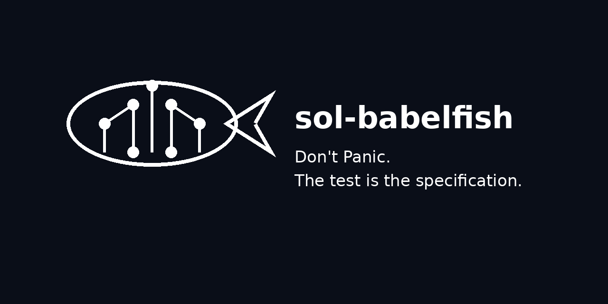

# sol-babelfish

> **Towel included**

The Solana ecosystem has many runtimes, simulators, validators, frameworks, and opinions.

This project begins with a simple observation:

> If two implementations disagree, the test should decide.

`sol-babelfish` is an effort to establish a common language for Solana testing. A test should describe behavior, not allegiance. Whether that behavior is exercised by LiteSVM, Mollusk, Surfpool, Agave, Anchor, Pinocchio, or something not yet invented is an implementation detail.

The specification lives in the test.

The runtime answers to it.

## Why?

Every ecosystem eventually discovers the same problem.

Frameworks multiply.

Runtimes diverge.

Conventions emerge.

Assumptions calcify.

Soon enough, developers spend more time discussing *how* something was tested than *what* was tested.

The result is a Tower of Babel built from fixtures, harnesses, adapters, and tribal knowledge.

`sol-babelfish` exists to make those systems intelligible to one another.

Not by translating tests.

By giving them a common language.

## Principles

### The test is the specification

Tests are executable statements about expected behavior.

When implementations disagree, the specification should remain unchanged.

### Runtimes are implementations

A runtime is an interpreter of the specification.

Different runtimes may vary in performance, diagnostics, fidelity, or features.

Behavior should not.

### Portability is a feature

A useful test should survive changes in infrastructure.

The specification should outlive any particular framework.

### Diagnostics are evidence

When a test fails, the question is not "who is right?"

The question is:

> What does the evidence say?

Logs, traces, call trees, events, balances, authorities, and state transitions are all witnesses.

The specification is the judge.

## A Brief Guide to Life, the Universe, and Testing

The history of software can be viewed as a long sequence of attempts to answer increasingly complicated questions.

Some examples:

* Does it compile?
* Does it run?
* Does it work?
* Does it work on my machine?
* Does it work on their machine?
* Does it still work?
* Why doesn't it work?
* Why does it work?

The final question is traditionally the most expensive.

The answer is rarely 42.

But a well-written test often gets surprisingly close.

## Status

Still under construction.

Bring your runtimes.

Bring your frameworks.

Bring your assumptions.

We'll see what survives contact with the specification.

---

**Don't Panic. The test is the specification.**

